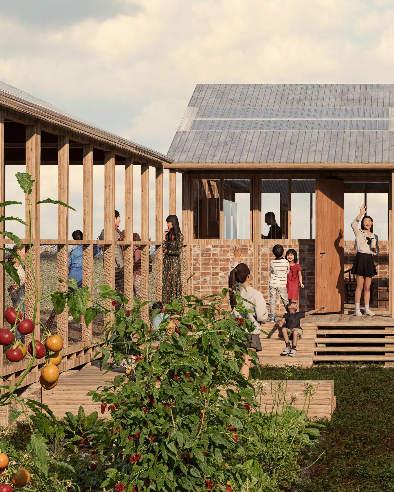
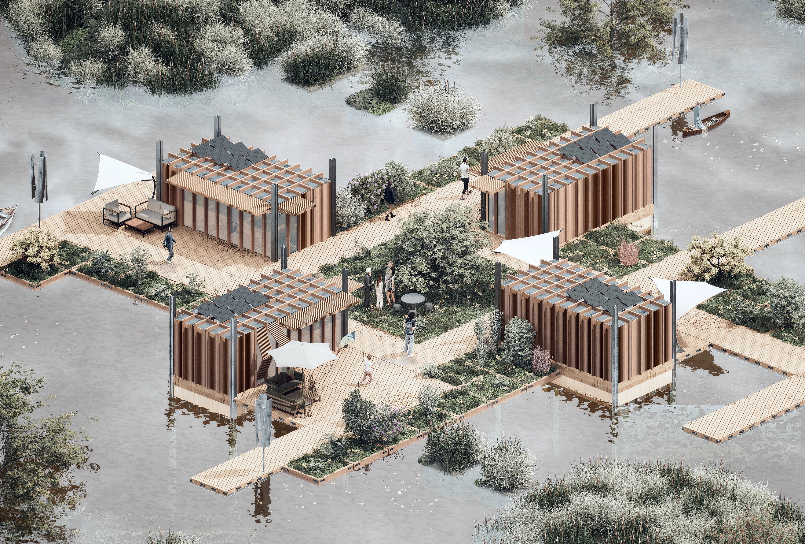

# SPRINT.md — HDGR Sprint 1
## 2026-03-18 — Tutti i task da implementare

Leggi CLAUDE.md prima di questo file.
Ogni task è indipendente — implementare uno alla volta, testare, committare.

---

## TASK 0 — BUG FIX (priorità massima, fare PRIMA di tutto)

### 0.1 — Hero subtitle centrato
File: css/layout.css

Trovare `.hero-title` e sostituire con:
```css
.hero-title {
  position: absolute;
  top: 50%;
  left: 50%;
  transform: translate(-50%, -50%);
  text-align: center;
  white-space: nowrap;
  z-index: 3;
  mix-blend-mode: difference;
  pointer-events: none;
}
```
Verificare che .hero-new-title e .hero-new-subtitle siano display:block e text-align:center.

### 0.2 — Hero animation: finisce per forza in entrambe le direzioni
File: js/hero.js

Nel ScrollTrigger per lo shrink (quello con onEnter/onUpdate/onLeaveBack),
sostituire l'intero blocco onUpdate con:

```js
onUpdate: (self) => {
  if (self.direction === -1) {
    // Gia' in corso verso 0? lascia andare
    if (controlTween && !controlTween.paused() &&
        shrinkTl.progress() > 0 && shrinkTl.progress() < 1) {
      const target = controlTween.vars && controlTween.vars.progress;
      if (target === 0) return;
    }
    if (controlTween) { controlTween.kill(); controlTween = null; }
    imgWrap.style.willChange = 'top, right, bottom, left';
    controlTween = gsap.to(shrinkTl, {
      progress: 0,
      duration: 1.2,
      ease: 'power3.inOut',
      onComplete: () => {
        imgWrap.style.willChange = 'auto';
        if (services) services.style.pointerEvents = 'none';
        controlTween = null;
      }
    });
  }
},
```

### 0.3 — Go back → pagina nera su index.html
File: js/transitions.js

In pageEnter(), sostituire il blocco isBack con:
```js
if (this.prefersReducedMotion || isBack) {
  this.curtain.style.transition = 'none';
  this.curtain.style.transform = 'translateY(100%)';
  if (typeof gsap !== 'undefined') {
    gsap.killTweensOf(this.curtain);
    gsap.set(this.curtain, { yPercent: 100 });
  }
  return;
}
// Forward enter
if (typeof gsap === 'undefined') {
  this.curtain.style.transition = 'transform 0.5s ease';
  this.curtain.style.transform = 'translateY(-100%)';
  setTimeout(() => { this.curtain.style.transform = 'translateY(100%)'; }, 600);
  return;
}
gsap.to(this.curtain, {
  yPercent: -100,
  duration: 0.5,
  ease: 'power3.out',
  onComplete: () => gsap.set(this.curtain, { yPercent: 100 })
});
```

---

## TASK 1 — LANGUAGE SWITCHER

### File da creare: js/lang.js

```js
/* lang.js — Language switcher EN/ES/PL/ZH
 * - Legge lingua da localStorage('hdgr-lang'), default 'en'
 * - Applica traduzione a tutti gli elementi [data-i18n="key"]
 * - Salva al click
 */
const TRANSLATIONS = {
  en: {
    'nav.about': 'About Us',
    'nav.investment': 'Investment Opportunities',
    'nav.news': 'News',
    'nav.contact': 'Contact',
    'hero.subtitle': 'Design & Development',
    'section.projects': 'Award-Winning Projects',
    'section.about': 'About Us',
    'section.visualizations': 'Visualizations',
    'section.interior': 'Interior Design',
    'section.portfolio': 'Property Portfolio',
    'section.investment': 'Investment Opportunities',
    'footer.touch': 'Get in touch',
    'footer.follow': 'Follow us',
    'footer.contact-btn': 'Contact Our Team',
    'statement.main': 'Design That Lasts, Development That Matters',
    'btn.all-projects': 'All projects →',
    'btn.go-back': '← Go back',
    'btn.explore': 'Explore',
    'btn.buyer-journey': 'Check Buyer Journey',
    'form.firstname': 'First name',
    'form.lastname': 'Last name',
    'form.email': 'Email',
    'form.message': 'Message',
    'form.send': 'Send Inquiry',
    'role.designer': 'Designer',
    'role.business': 'Business Development',
    'role.finance': 'Finance',
  },
  es: {
    'nav.about': 'Sobre Nosotros',
    'nav.investment': 'Oportunidades de Inversión',
    'nav.news': 'Noticias',
    'nav.contact': 'Contacto',
    'hero.subtitle': 'Diseño y Desarrollo',
    'section.projects': 'Proyectos Premiados',
    'section.about': 'Sobre Nosotros',
    'section.visualizations': 'Visualizaciones',
    'section.interior': 'Diseño de Interiores',
    'section.portfolio': 'Cartera de Propiedades',
    'section.investment': 'Oportunidades de Inversión',
    'footer.touch': 'Contacto',
    'footer.follow': 'Síguenos',
    'footer.contact-btn': 'Contactar al Equipo',
    'statement.main': 'Diseño que perdura, desarrollo que importa',
    'btn.all-projects': 'Todos los proyectos →',
    'btn.go-back': '← Volver',
    'btn.explore': 'Explorar',
    'btn.buyer-journey': 'Ver Guía del Comprador',
    'form.firstname': 'Nombre',
    'form.lastname': 'Apellido',
    'form.email': 'Correo electrónico',
    'form.message': 'Mensaje',
    'form.send': 'Enviar Consulta',
    'role.designer': 'Diseñador/a',
    'role.business': 'Desarrollo de Negocio',
    'role.finance': 'Finanzas',
  },
  pl: {
    'nav.about': 'O Nas',
    'nav.investment': 'Możliwości Inwestycyjne',
    'nav.news': 'Aktualności',
    'nav.contact': 'Kontakt',
    'hero.subtitle': 'Projekt i Rozwój',
    'section.projects': 'Nagradzane Projekty',
    'section.about': 'O Nas',
    'section.visualizations': 'Wizualizacje',
    'section.interior': 'Projektowanie Wnętrz',
    'section.portfolio': 'Portfolio Nieruchomości',
    'section.investment': 'Możliwości Inwestycyjne',
    'footer.touch': 'Skontaktuj się',
    'footer.follow': 'Obserwuj nas',
    'footer.contact-btn': 'Skontaktuj się z Zespołem',
    'statement.main': 'Projekt na lata, rozwój który ma znaczenie',
    'btn.all-projects': 'Wszystkie projekty →',
    'btn.go-back': '← Wróć',
    'btn.explore': 'Odkryj',
    'btn.buyer-journey': 'Przewodnik Kupującego',
    'form.firstname': 'Imię',
    'form.lastname': 'Nazwisko',
    'form.email': 'E-mail',
    'form.message': 'Wiadomość',
    'form.send': 'Wyślij Zapytanie',
    'role.designer': 'Projektant/ka',
    'role.business': 'Rozwój Biznesu',
    'role.finance': 'Finanse',
  },
  zh: {
    'nav.about': '关于我们',
    'nav.investment': '投资机会',
    'nav.news': '新闻',
    'nav.contact': '联系',
    'hero.subtitle': '设计与开发',
    'section.projects': '获奖项目',
    'section.about': '关于我们',
    'section.visualizations': '可视化',
    'section.interior': '室内设计',
    'section.portfolio': '房产组合',
    'section.investment': '投资机会',
    'footer.touch': '联系我们',
    'footer.follow': '关注我们',
    'footer.contact-btn': '联系团队',
    'statement.main': '经久设计，有意开发',
    'btn.all-projects': '所有项目 →',
    'btn.go-back': '← 返回',
    'btn.explore': '探索',
    'btn.buyer-journey': '买家指南',
    'form.firstname': '名字',
    'form.lastname': '姓氏',
    'form.email': '电子邮件',
    'form.message': '留言',
    'form.send': '发送咨询',
    'role.designer': '设计师',
    'role.business': '业务发展',
    'role.finance': '财务',
  }
};

(function() {
  function getLang() {
    return localStorage.getItem('hdgr-lang') || 'en';
  }

  function applyLang(lang) {
    const t = TRANSLATIONS[lang] || TRANSLATIONS.en;
    document.querySelectorAll('[data-i18n]').forEach(el => {
      const key = el.getAttribute('data-i18n');
      if (t[key]) el.textContent = t[key];
    });
    document.querySelectorAll('[data-i18n-placeholder]').forEach(el => {
      const key = el.getAttribute('data-i18n-placeholder');
      if (t[key]) el.placeholder = t[key];
    });
    document.documentElement.setAttribute('data-lang', lang);
    document.documentElement.setAttribute('lang', lang === 'zh' ? 'zh-CN' : lang);
    const btn = document.querySelector('.lang-current');
    if (btn) btn.textContent = lang.toUpperCase();
  }

  function init() {
    const lang = getLang();
    applyLang(lang);

    const switcher = document.querySelector('.lang-switcher');
    if (!switcher) return;

    const current = switcher.querySelector('.lang-current');
    const dropdown = switcher.querySelector('.lang-dropdown');

    current.addEventListener('click', (e) => {
      e.stopPropagation();
      dropdown.classList.toggle('is-open');
    });

    switcher.querySelectorAll('[data-lang-option]').forEach(item => {
      item.addEventListener('click', () => {
        const selected = item.getAttribute('data-lang-option');
        localStorage.setItem('hdgr-lang', selected);
        applyLang(selected);
        dropdown.classList.remove('is-open');
      });
    });

    document.addEventListener('click', () => dropdown.classList.remove('is-open'));
  }

  document.addEventListener('DOMContentLoaded', init);
})();
```

### File da modificare: css/components.css
Aggiungere in fondo:

```css
/* ── Language Switcher ── */
.lang-switcher {
  position: relative;
  display: flex;
  align-items: center;
  margin-right: var(--space-4);
}

.lang-current {
  background: none;
  border: none;
  font-family: var(--font-mono);
  font-size: var(--step--2);
  letter-spacing: 0.1em;
  text-transform: uppercase;
  color: var(--color-white);
  cursor: pointer;
  padding: 0;
  transition: opacity var(--transition-base);
}

.lang-current:hover { opacity: 0.6; }

header.header-dark .lang-current { color: var(--color-text); }

.lang-dropdown {
  display: none;
  position: absolute;
  top: calc(100% + 8px);
  right: 0;
  background: var(--color-bg);
  border: 1px solid var(--color-border);
  z-index: calc(var(--z-header) + 1);
  min-width: 60px;
}

.lang-dropdown.is-open { display: block; }

.lang-dropdown li {
  font-family: var(--font-mono);
  font-size: var(--step--2);
  letter-spacing: 0.1em;
  text-transform: uppercase;
  color: var(--color-text);
  padding: 8px 12px;
  cursor: pointer;
  transition: opacity var(--transition-base);
}

.lang-dropdown li:hover { opacity: 0.5; }
```

### Aggiungere in OGNI header HTML (dopo logo, prima di menu-toggle):
```html
<div class="lang-switcher" role="listbox" aria-label="Language">
  <button class="lang-current">EN</button>
  <ul class="lang-dropdown" role="list">
    <li data-lang-option="en" role="option">EN</li>
    <li data-lang-option="es" role="option">ES</li>
    <li data-lang-option="pl" role="option">PL</li>
    <li data-lang-option="zh" role="option">ZH</li>
  </ul>
</div>
```

### Aggiungere data-i18n agli elementi traducibili nei file HTML
Esempi chiave:
- Menu overlay: `<a href="#about"><span data-i18n="nav.about">About Us</span></a>`
- Section headers: `<h2 data-i18n="section.projects">Award-Winning Projects</h2>`
- Footer: `<h4 data-i18n="footer.touch">Get in touch</h4>`
- Hero subtitle: `<p class="hero-new-subtitle" data-i18n="hero.subtitle">Design & Development</p>`
- Statement: `<p data-i18n="statement.main">Design That Lasts...</p>`
- Bottoni: `<span data-i18n="btn.go-back">← Go back</span>`

---

## TASK 2 — CONTACT OUR TEAM BUTTON + FORM

### File da modificare: TUTTI gli HTML (footer section)

Dentro `.footer-contact`, aggiungere dopo i div esistenti:
```html
<div class="contact-form-wrap">
  <button class="contact-form-toggle" data-i18n="footer.contact-btn">Contact Our Team</button>
  <form class="contact-form" hidden action="mailto:contact@hdgr.eu" method="POST" enctype="text/plain">
    <div class="contact-form-row">
      <input type="text" name="firstname" data-i18n-placeholder="form.firstname" placeholder="First name">
      <input type="text" name="lastname" data-i18n-placeholder="form.lastname" placeholder="Last name">
    </div>
    <input type="email" name="email" data-i18n-placeholder="form.email" placeholder="Email">
    <textarea name="message" rows="4" data-i18n-placeholder="form.message" placeholder="Message"></textarea>
    <button type="submit" data-i18n="form.send">Send Inquiry</button>
  </form>
</div>
```

### CSS da aggiungere in components.css:
```css
/* ── Contact Form ── */
.contact-form-wrap {
  margin-top: var(--space-8);
  border-top: 1px solid var(--color-border);
  padding-top: var(--space-8);
}

.contact-form-toggle {
  background: none;
  border: 1px solid var(--color-text);
  font-family: var(--font-mono);
  font-size: var(--step--1);
  letter-spacing: 0.08em;
  text-transform: uppercase;
  color: var(--color-text);
  padding: 10px 20px;
  cursor: pointer;
  transition: background var(--transition-base), color var(--transition-base);
}

.contact-form-toggle:hover {
  background: var(--color-text);
  color: var(--color-white);
}

.contact-form {
  margin-top: var(--space-8);
  display: flex;
  flex-direction: column;
  gap: var(--space-4);
}

.contact-form-row {
  display: grid;
  grid-template-columns: 1fr 1fr;
  gap: var(--space-4);
}

.contact-form input,
.contact-form textarea {
  font-family: var(--font-mono);
  font-size: var(--step--1);
  background: transparent;
  border: 1px solid var(--color-border);
  padding: 10px 12px;
  color: var(--color-text);
  width: 100%;
  outline: none;
  transition: border-color var(--transition-base);
}

.contact-form input:focus,
.contact-form textarea:focus {
  border-color: var(--color-text);
}

.contact-form textarea { resize: vertical; }

.contact-form button[type="submit"] {
  align-self: flex-start;
  background: var(--color-text);
  border: 1px solid var(--color-text);
  font-family: var(--font-mono);
  font-size: var(--step--1);
  letter-spacing: 0.08em;
  text-transform: uppercase;
  color: var(--color-white);
  padding: 10px 24px;
  cursor: pointer;
  transition: background var(--transition-base), color var(--transition-base);
}

.contact-form button[type="submit"]:hover {
  background: transparent;
  color: var(--color-text);
}

@media (max-width: 768px) {
  .contact-form-row { grid-template-columns: 1fr; }
}
```

### JS inline (aggiungere in menu.js o come script separato contact-form.js):
```js
/* contact-form.js — Toggle inline contact form */
document.addEventListener('DOMContentLoaded', () => {
  document.querySelectorAll('.contact-form-toggle').forEach(btn => {
    btn.addEventListener('click', () => {
      const form = btn.nextElementSibling;
      if (!form) return;
      const isHidden = form.hidden;
      form.hidden = false;
      if (isHidden) {
        form.style.maxHeight = '0';
        form.style.overflow = 'hidden';
        form.style.transition = 'max-height 0.4s ease';
        requestAnimationFrame(() => {
          form.style.maxHeight = form.scrollHeight + 'px';
        });
        form.addEventListener('transitionend', () => {
          form.style.maxHeight = '';
          form.style.overflow = '';
        }, { once: true });
      } else {
        form.style.maxHeight = form.scrollHeight + 'px';
        form.style.overflow = 'hidden';
        requestAnimationFrame(() => { form.style.maxHeight = '0'; });
        form.addEventListener('transitionend', () => {
          form.hidden = true;
          form.style.maxHeight = '';
          form.style.overflow = '';
        }, { once: true });
      }
    });
  });
});
```

---

## TASK 3 — AWARD-WINNING PROJECTS: SLIDES

### File: index.html — sezione .projects

Sostituire la struttura .projects-masonry--columns con slides orizzontali:

```html
<div class="projects-slides-wrap">
  <div class="projects-slides">

    <!-- Nepal School — con badge award -->
    <article class="project-slide">
      <a href="projects/nepal.html">
        <div class="project-slide-img">
          
          <div class="project-slide-award">
            <span class="award-title">NEPAL SCHOOL CONTEST</span>
            <span class="award-sub">1ST PRICE ZURICH INSTITUT — 2025</span>
          </div>
          <div class="project-slide-quote">"This shi tuff" — Adolf Muller</div>
        </div>
        <div class="project-card-meta">
          <div class="project-card-title">
            <h3>Nepal School</h3>
            <span class="project-year">2024</span>
          </div>
          <p class="project-type">Nepal — Public</p>
        </div>
      </a>
    </article>

    <!-- Brick House -->
    <article class="project-slide">
      <a href="projects/brick-house.html">
        <div class="project-slide-img">
          
        </div>
        <div class="project-card-meta">
          <div class="project-card-title">
            <h3>Brick House</h3>
            <span class="project-year">2023</span>
          </div>
          <p class="project-type">Warsaw — Residential</p>
        </div>
      </a>
    </article>

    <!-- Microhome -->
    <article class="project-slide">
      <a href="projects/microhome.html">
        <div class="project-slide-img">
          
        </div>
        <div class="project-card-meta">
          <div class="project-card-title">
            <h3>Microhome</h3>
            <span class="project-year">2023</span>
          </div>
          <p class="project-type">Warsaw — Residential</p>
        </div>
      </a>
    </article>

  </div><!-- /projects-slides -->
</div><!-- /projects-slides-wrap -->
```

### CSS da aggiungere in components.css:
```css
/* ── Projects Slides (Award-Winning) ── */
.projects-slides-wrap {
  position: relative;
  overflow: hidden;
}

.projects-slides {
  display: flex;
  gap: var(--space-8);
  overflow-x: auto;
  scroll-snap-type: x mandatory;
  -webkit-overflow-scrolling: touch;
  scrollbar-width: none;
  padding-bottom: var(--space-4);
}

.projects-slides::-webkit-scrollbar { display: none; }

.project-slide {
  flex: 0 0 clamp(300px, 55vw, 720px);
  scroll-snap-align: start;
}

.project-slide a { display: block; }
.project-slide a:hover { opacity: 1; }

.project-slide-img {
  position: relative;
  overflow: hidden;
  aspect-ratio: 4/3;
}

.project-slide-img img {
  width: 100%;
  height: 100%;
  object-fit: cover;
  display: block;
  transition: transform var(--transition-slow);
}

.project-slide:hover .project-slide-img img {
  transform: scale(1.04);
}

.project-slide-award {
  position: absolute;
  top: var(--space-4);
  left: var(--space-4);
  background: var(--color-overlay);
  color: var(--color-white);
  padding: 6px 12px;
  display: flex;
  flex-direction: column;
  gap: 2px;
}

.award-title {
  font-family: var(--font-mono);
  font-size: var(--step--1);
  letter-spacing: 0.08em;
  text-transform: uppercase;
  font-weight: 700;
}

.award-sub {
  font-family: var(--font-mono);
  font-size: var(--step--2);
  letter-spacing: 0.06em;
  text-transform: uppercase;
  opacity: 0.8;
}

.project-slide-quote {
  position: absolute;
  bottom: var(--space-4);
  left: var(--space-4);
  right: var(--space-4);
  font-family: var(--font-mono);
  font-size: var(--step--1);
  font-style: italic;
  color: var(--color-white);
  text-shadow: 0 1px 4px rgba(0,0,0,0.6);
}

@media (max-width: 768px) {
  .project-slide {
    flex: 0 0 85vw;
  }
}
```

---

## TASK 4 — BUYER JOURNEY (portfolio.html)

Testo completo dei 8 step:

1. **Selection of Preferred Property** — Choose the apartment that best matches your lifestyle, investment goals, and budget. Consider factors such as layout, floor level, views, orientation, and access to building facilities.

2. **Sales Consultation** — Speak with our sales team to learn more about the project, property specifications, payment structure, and the overall purchasing process. Use this opportunity to ask any questions and receive professional guidance.

3. **Virtual/Physical Viewing** — Attend a virtual tour or schedule an in-person viewing of the property. Explore the building, surrounding neighbourhood, and available amenities.

4. **Reservation** — Secure your chosen apartment by signing a reservation agreement and paying the initial reservation deposit. This step temporarily removes the property from the market.

5. **Initial Documentation** — Appoint a lawyer or legal advisor to assist with the transaction. Prepare the required identification and financial documentation, open a local bank account if necessary, and complete any required administrative steps for foreign/domestic buyers.

6. **Purchase Contract** — Sign the private purchase agreement outlining the purchase price, payment method, and conditions of transaction. Complete the agreed deposit payment.

7. **Final Signing** — Finalize the purchase by signing the official title deed or transfer documents before the relevant legal authority. Transfer the remaining balance to complete the transaction.

8. **Property Handover & Ownership Transfer** — Receive the keys to your property and the official ownership documentation. Arrange utilities and property management if required.

### HTML da aggiungere in portfolio.html (DOPO .portfolio-grid, PRIMA del footer):
```html
<section class="buyer-journey">
  <div class="container">
    <button class="buyer-journey-toggle" data-i18n="btn.buyer-journey">
      Check Buyer Journey
    </button>
    <div class="buyer-journey-content" hidden>
      <div class="buyer-journey-steps">
        <div class="buyer-step">
          <span class="buyer-step-num">01</span>
          <div>
            <h4>Selection of Preferred Property</h4>
            <p>Choose the apartment that best matches your lifestyle, investment goals, and budget. Consider factors such as layout, floor level, views, orientation, and access to building facilities.</p>
          </div>
        </div>
        <div class="buyer-step">
          <span class="buyer-step-num">02</span>
          <div>
            <h4>Sales Consultation</h4>
            <p>Speak with our sales team to learn more about the project, property specifications, payment structure, and the overall purchasing process.</p>
          </div>
        </div>
        <div class="buyer-step">
          <span class="buyer-step-num">03</span>
          <div>
            <h4>Virtual/Physical Viewing</h4>
            <p>Attend a virtual tour or schedule an in-person viewing of the property. Explore the building, surrounding neighbourhood, and available amenities.</p>
          </div>
        </div>
        <div class="buyer-step">
          <span class="buyer-step-num">04</span>
          <div>
            <h4>Reservation</h4>
            <p>Secure your chosen apartment by signing a reservation agreement and paying the initial reservation deposit. This step temporarily removes the property from the market.</p>
          </div>
        </div>
        <div class="buyer-step">
          <span class="buyer-step-num">05</span>
          <div>
            <h4>Initial Documentation</h4>
            <p>Appoint a lawyer or legal advisor to assist with the transaction. Prepare the required identification and financial documentation, open a local bank account if necessary.</p>
          </div>
        </div>
        <div class="buyer-step">
          <span class="buyer-step-num">06</span>
          <div>
            <h4>Purchase Contract</h4>
            <p>Sign the private purchase agreement outlining the purchase price, payment method, and conditions of transaction. Complete the agreed deposit payment.</p>
          </div>
        </div>
        <div class="buyer-step">
          <span class="buyer-step-num">07</span>
          <div>
            <h4>Final Signing</h4>
            <p>Finalize the purchase by signing the official title deed or transfer documents before the relevant legal authority. Transfer the remaining balance to complete the transaction.</p>
          </div>
        </div>
        <div class="buyer-step">
          <span class="buyer-step-num">08</span>
          <div>
            <h4>Property Handover & Ownership Transfer</h4>
            <p>Receive the keys to your property and the official ownership documentation. Arrange utilities and property management if required.</p>
          </div>
        </div>
      </div>
    </div>
  </div>
</section>
```

### CSS da aggiungere in components.css:
```css
/* ── Buyer Journey ── */
.buyer-journey {
  padding: var(--space-16) 0;
  border-top: 1px solid var(--color-border);
}

.buyer-journey-toggle {
  background: none;
  border: 1px solid var(--color-text);
  font-family: var(--font-mono);
  font-size: var(--step--1);
  letter-spacing: 0.08em;
  text-transform: uppercase;
  color: var(--color-text);
  padding: 10px 24px;
  cursor: pointer;
  transition: background var(--transition-base), color var(--transition-base);
}

.buyer-journey-toggle:hover {
  background: var(--color-text);
  color: var(--color-white);
}

.buyer-journey-content {
  margin-top: var(--space-12);
  overflow: hidden;
  transition: max-height 0.5s ease;
}

.buyer-journey-steps {
  display: grid;
  grid-template-columns: 1fr 1fr;
  gap: var(--space-8) var(--space-12);
}

.buyer-step {
  display: flex;
  gap: var(--space-4);
  padding-top: var(--space-4);
  border-top: 1px solid var(--color-border);
}

.buyer-step-num {
  font-size: var(--step-2);
  font-weight: 700;
  color: var(--color-text-muted);
  flex-shrink: 0;
  line-height: 1;
  width: 2.5ch;
}

.buyer-step h4 {
  font-size: var(--step-0);
  font-weight: 700;
  letter-spacing: 0.03em;
  text-transform: none;
  margin-bottom: var(--space-4);
}

.buyer-step p {
  font-size: var(--step--1);
  line-height: 1.7;
  color: var(--color-text-muted);
}

@media (max-width: 768px) {
  .buyer-journey-steps { grid-template-columns: 1fr; }
}
```

### JS per toggle (aggiungere in contact-form.js o file separato buyer-journey.js):
Usare lo stesso pattern di contact-form.js con max-height animation.

---

## TASK 5 — INVESTMENT OPPORTUNITIES PAGE (investment.html)

Creare file: investment.html

Struttura base copiata da projects.html (header, footer, curtain, script).

Contenuto principale:
```html
<section class="investment-opportunities">
  <div class="container">

    <div class="section-header section-header--centered">
      <h2 data-i18n="section.investment">Investment Opportunities</h2>
    </div>

    <p class="investment-intro">
      Investment structures differ depending on the origin of the investor and the target market.
      Explore the pathway that fits your case.
    </p>

    <!-- Tab switcher -->
    <div class="investment-tabs">
      <button class="inv-tab is-active" data-tab="eu-eu">European investors in EU</button>
      <button class="inv-tab" data-tab="latam-eu">LatAm investors in EU</button>
      <button class="inv-tab" data-tab="asia-eu">Asian investors in EU</button>
      <button class="inv-tab" data-tab="eu-latam">EU investors in LatAm/ASEAN</button>
    </div>

    <!-- Tab panels — stesso flowchart per tutti e 4, tab switcher solo visuale per ora -->
    <div class="investment-panel is-active" data-panel="eu-eu">
      <!-- SVG flowchart -->
    </div>
    <div class="investment-panel" data-panel="latam-eu">...</div>
    <div class="investment-panel" data-panel="asia-eu">...</div>
    <div class="investment-panel" data-panel="eu-latam">...</div>

    <p class="investment-cta">
      <a href="portfolio.html">Click here</a> to explore available opportunities and begin crafting
      an investment structure tailored to your goals and preferred markets.
    </p>

  </div>
</section>
```

Flowchart SVG per ogni panel (stessa struttura per tutti e 4):
```
[Investor Consultation] → [Opportunity Presentation] → [In-House Architecture & Development Proposal]
                                                                          ↓ (arco curvo ritorno)
[Development & Execution] ← [Resource Acquisition] ← [Investment Agreement]
           ↓
    [Exit]    [Hold] → [Property Management]
```

Implementare come SVG inline responsive con testo Space Mono, colori --color-text e --color-border.
Nodi: rettangoli con border 1px, no border-radius, padding 8px 16px.
Frecce: linee con marcatore freccia SVG.

Tab switcher JS (inline in investment.html o file investment.js):
```js
document.querySelectorAll('.inv-tab').forEach(tab => {
  tab.addEventListener('click', () => {
    document.querySelectorAll('.inv-tab').forEach(t => t.classList.remove('is-active'));
    document.querySelectorAll('.investment-panel').forEach(p => p.classList.remove('is-active'));
    tab.classList.add('is-active');
    const panel = document.querySelector('[data-panel="' + tab.dataset.tab + '"]');
    if (panel) panel.classList.add('is-active');
  });
});
```

CSS tabs + panels:
```css
.investment-intro {
  font-size: var(--step-0);
  line-height: 1.7;
  margin-bottom: var(--space-12);
  max-width: 60ch;
}

.investment-tabs {
  display: flex;
  gap: 0;
  border-bottom: 1px solid var(--color-border);
  margin-bottom: var(--space-12);
  flex-wrap: wrap;
}

.inv-tab {
  background: none;
  border: none;
  border-bottom: 2px solid transparent;
  font-family: var(--font-mono);
  font-size: var(--step--1);
  letter-spacing: 0.06em;
  text-transform: uppercase;
  color: var(--color-text-muted);
  padding: 12px 20px;
  cursor: pointer;
  transition: color var(--transition-base), border-color var(--transition-base);
  margin-bottom: -1px;
}

.inv-tab:hover { color: var(--color-text); }
.inv-tab.is-active {
  color: var(--color-text);
  border-bottom-color: var(--color-text);
}

.investment-panel { display: none; }
.investment-panel.is-active { display: block; }

.investment-cta {
  margin-top: var(--space-12);
  font-size: var(--step-0);
  font-style: italic;
}

.investment-cta a {
  text-decoration: underline;
}

@media (max-width: 768px) {
  .investment-tabs { flex-direction: column; border-bottom: none; }
  .inv-tab { border-bottom: 1px solid var(--color-border); text-align: left; }
  .inv-tab.is-active { border-bottom-color: var(--color-text); }
}
```

---

## TASK 6 — SOCIAL LINKS + MOBILE QUOTE FIX

### 6.1 Social links reali
In TUTTI i file HTML, sostituire:
- `href="#" rel="noopener noreferrer">Instagram` → `href="https://www.instagram.com/hdgr.eu/" target="_blank" rel="noopener noreferrer">Instagram`
- `href="#" rel="noopener noreferrer">LinkedIn` → `href="https://www.linkedin.com/company/hdgr-architecture/" target="_blank" rel="noopener noreferrer">LinkedIn`

### 6.2 Mobile quote fix (index.html + css)
CSS: nascondere .studio-statement (prima, sopra .projects) su mobile:
```css
@media (max-width: 768px) {
  .hero + .studio-statement { display: none; }
}
```
La quote sotto .about: aggiornare testo da "Building What Time Approves" a "Design That Lasts, Development That Matters".

### 6.3 Quote font-weight
In components.css, per .studio-statement p e .studio-quote blockquote:
```css
font-weight: 700;
```

### 6.4 About mobile: 2+ persone visibili
In layout.css @media max-width 768px, cambiare .about-grid .about-member:
```css
flex: 0 0 42vw;
min-width: 42vw;
```

---

## ORDINE DI ESECUZIONE CONSIGLIATO

1. TASK 0 (bug fix — nessun rischio regressione)
2. TASK 6.1 (social links — find/replace globale)
3. TASK 6.2/6.3/6.4 (mobile fixes — CSS only)
4. TASK 1 (lang switcher — nuovo file JS + CSS addizioni)
5. TASK 2 (contact form — addizioni HTML+CSS+JS)
6. TASK 3 (slides award-winning — sostituzione HTML + CSS)
7. TASK 4 (buyer journey — addizioni portfolio.html + CSS)
8. TASK 5 (investment page — nuovo file HTML)

Commit separato per ogni task. Messaggio commit: "feat: [nome task]" o "fix: [nome fix]".

---

v1.0 — 2026-03-18
